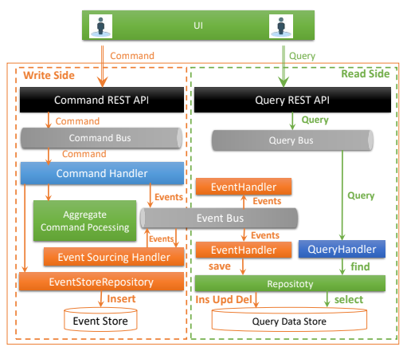
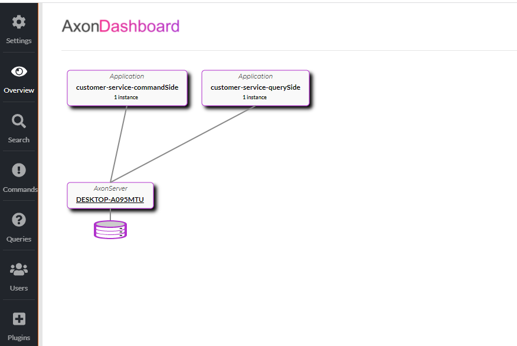
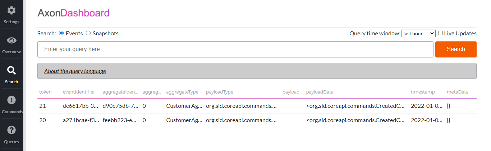
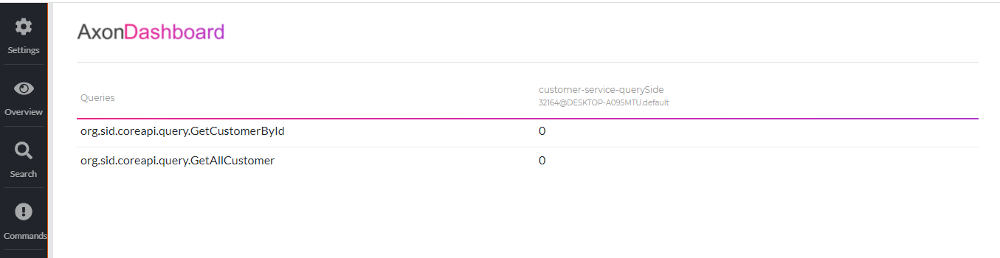

# CQRS-Event-Sourcing_With_AXON-Framwork_Spring-Cloud

## Application
Développer un micro-service basé sur CQRS et Event Sourcing en utilisant AXON Server Externe. Ce micro service permet de gérer des clients.  Dans ce projet, il faut séparer les deux parties Command et Query dans deux micro-services indépendants. Le projet  doit respecter l'architecture suivante.
Le Projet se compose de trois modules :
-  Le projet principale customer-service  est un projet Spring boot incluant toutes les dépendances
- customer-core-api est un module de type Maven qui regroupe les composants communs aux deux parties Command et Query comme : Commands, Events, DTOs, Queries. Dans ce module, il faut utiliser Kotlin pour implémenter les différentes classes (Pour se familiariser avec Kotlin qui est très pratique pour créer les data class)
-  customer-service-command-side : est un moule de type Spring Boot qui implémente la partie commande du micro-service. Ce module utiliser le projet principal comme projet parent et utilise customer-core-api comme dépendances
-  customer-service-query-side : est un moule de type Spring Boot qui implémente la partie Query du micro-servi
    
## Architecture 
-  Event Driven Micro-services Architectures, CQRS & Event Sourcing Patterns : Spring Cloud & AXON Framework

 

## Technologie est Tools
- Event Driven Micro-services Architectures
- CQRS & Event Sourcing Patterns 
- Spring Cloud & AXON Framework
-Axon server 
- IntelliJ IDEA
- Java 8
- Maven
- Spring Boot
- Spring Boot DevTools
- H2 database
- lombok

## Axon server
http://localhost:8024/#overview
- Microservices 

  

- Events
  
  
  
- Queries
  
  

##  Use
Ce projet est un projet Spring boot 
- git clone repo
- Run commande-side (microservice Spring boot )
-Run query-side (microservice Spring boot )
- download axon server  [Axon server ](https://axoniq.io/product-overview/axon-server)
- deplacer vers le dossier :  cd axonquickstart-4.5.9\AxonServer>
- run Axon server : java -jar axonserver-4.5.9.jar
## Sources
pour plus de détails consulter les sources suivantes
- demo video  [Event Driven Micro Services Architecture ](https://www.youtube.com/watch?v=npP2GLYLW8c)
- Spring doc  [Spring cloud  doc](https://spring.io/projects/spring-cloud)
- Axon doc  [Axon  doc](https://axoniq.io/)

### Enjoy !!
 

